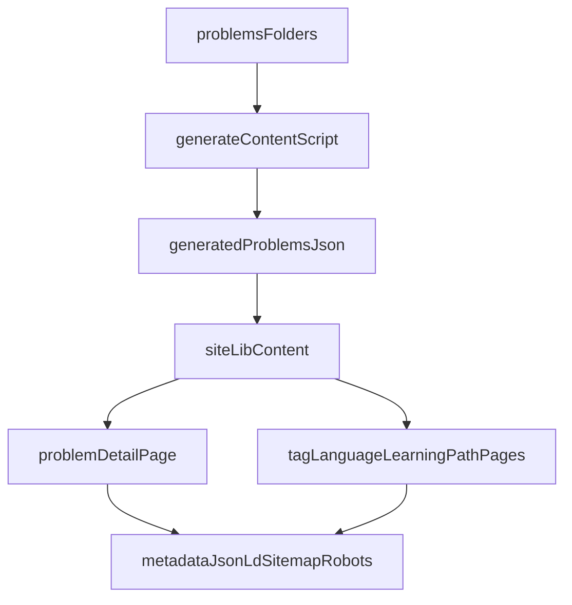

# SEO Docs Website Architecture

## Notes

- Canonical source content remains in `problems/`.
- Build-time generation creates `site/generated/problems.json`.
- Next.js routes under `site/app/` render problem and discovery pages.
- Search engines consume metadata, sitemap, and robots outputs from the app.
